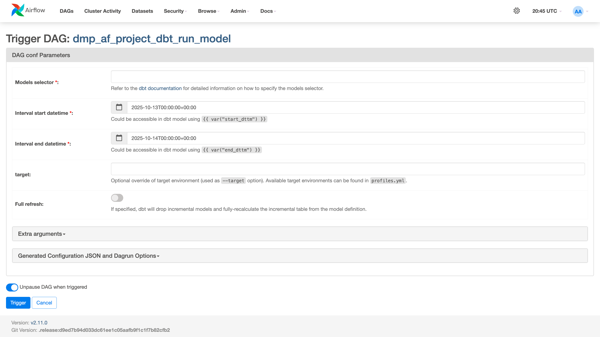

# Manual Run DAG

Run arbitrary dbt commands for backfills and testing.

## Overview

The `dbt_run_model` DAG allows manual execution of any dbt model with custom parameters.

## Features

- Model selector (supports dbt syntax)
- Custom date intervals
- Target override
- Full refresh option
- Extra arguments

## Usage

See [Configuration Reference](../configuration/model-config.md#dbt_run_model-dag) for details.

