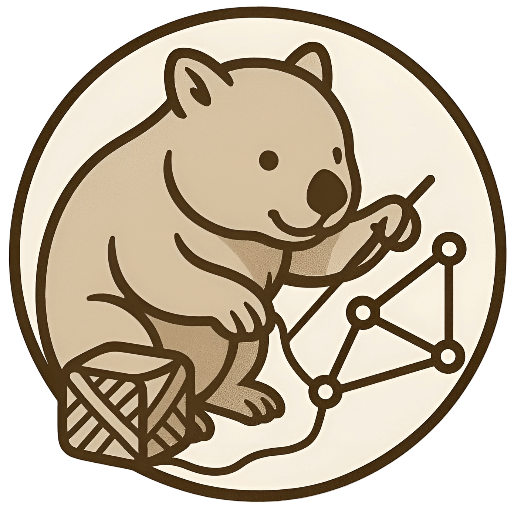
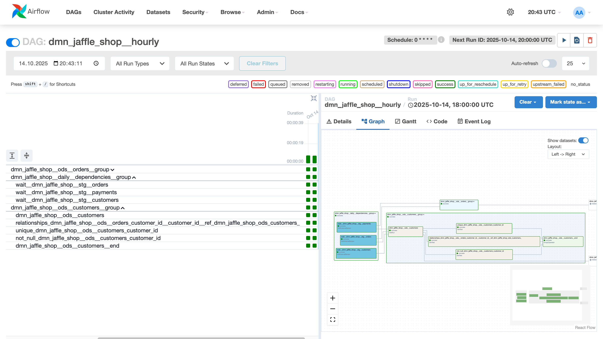
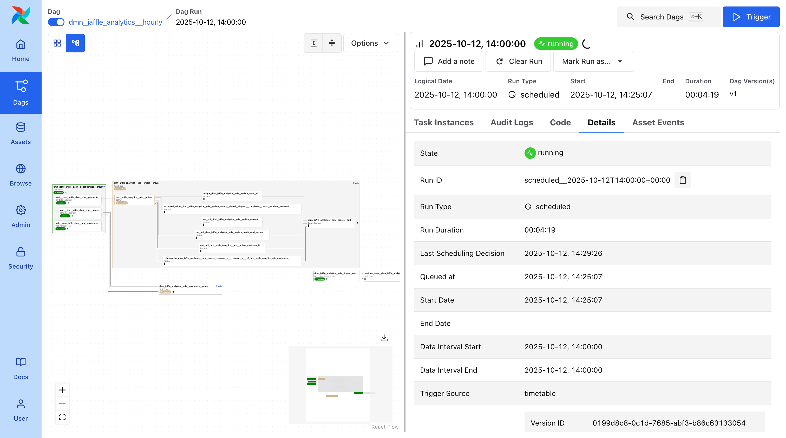

# dmp-af: Distributed dbt Runs on Airflow

<p align="center">
  
</p>


**dmp-af** runs your dbt models in parallel on Airflow. Each model becomes an independent task while preserving
dependencies across domains.

**Built for scale.** Designed for large dbt projects (1000+ models)
and [data mesh architecture](https://www.datamesh-architecture.com/#what-is-data-mesh). Works with any project size.




## Why dmp-af?

### 🏗️ Domain-Driven Architecture

Separate models by domain into different DAGs, run in parallel, perfect for data mesh architectures.

### 🎯 dbt-First Design

All configuration in dbt model configs. Analytics teams stay in dbt, no Airflow knowledge required.

### ⏰ Flexible Scheduling

Multiple schedules per model (`@hourly`, `@daily`, `@weekly`, `@monthly`, and more).

### 🚀 Enterprise Features

Multiple dbt targets, configurable test strategies, built-in maintenance, Kubernetes support.

## Quick Start

Install dmp-af on your Airflow cluster alongside your other dependencies:

```bash
# Add to your Airflow requirements.txt
pip install dmp-af

# Or add to requirements.txt
echo "dmp-af" >> requirements.txt
```

Create your first DAG:

```python
# dags/my_dags.py
from dmp_af.dags import compile_dmp_af_dags
from dmp_af.conf import Config, DbtDefaultTargetsConfig, DbtProjectConfig

config = Config(
    dbt_project=DbtProjectConfig(
        dbt_project_name='my_dbt_project',
        dbt_project_path='/path/to/my_dbt_project',
        dbt_models_path='/path/to/my_dbt_project/models',
        dbt_profiles_path='/path/to/my_dbt_project',
        dbt_target_path='/path/to/my_dbt_project/target',
        dbt_log_path='/path/to/my_dbt_project/logs',
        dbt_schema='my_dbt_schema',
    ),
    dbt_default_targets=DbtDefaultTargetsConfig(default_target='dev'),
)

dags = compile_dmp_af_dags(
    manifest_path='/path/to/my_dbt_project/target/manifest.json',
    config=config,
)

for dag_name, dag in dags.items():
    globals()[dag_name] = dag
```

[Get Started →](getting-started/index.md){ .md-button .md-button--primary }
[View Examples →](tutorials/index.md){ .md-button }

## Key Features

### ⚙️ Auto-Generated DAGs

Automatically creates Airflow DAGs from your dbt project, organized by domain and schedule. Handles dependencies across
domains seamlessly.

### 🔄 Idempotent Runs

Each model is a separate Airflow task with date intervals passed to every run. Reliable backfills and reruns guaranteed.

### 👥 Team-Friendly

Analytics teams stay in dbt. No Airflow DAG writing required. Infrastructure handled automatically.

## Requirements

dmp-af is tested with:

| Airflow version | Python versions | dbt-core versions |
|-----------------|-----------------|-------------------|
| 2.6.3           | ≥3.10,<3.12     | ≥1.7,≤1.10        |
| 2.7.3           | ≥3.10,<3.12     | ≥1.7,≤1.10        |
| 2.8.4           | ≥3.10,<3.12     | ≥1.7,≤1.10        |
| 2.9.3           | ≥3.10,<3.13     | ≥1.7,≤1.10        |
| 2.10.5          | ≥3.10,<3.13     | ≥1.7,≤1.10        |
| 2.11.0          | ≥3.10,<3.13     | ≥1.7,≤1.10        |
| 3.0.6           | ≥3.10,<3.13     | ≥1.7,≤1.10        |
| 3.1.3           | ≥3.10,<3.14     | ≥1.7,≤1.10        |

## About This Project

This project is a fork of [Toloka AI BV's original dbt-af repository](https://github.com/Toloka/dbt-af). It includes
substantial modifications by IJKOS & PARTNERS LTD. This fork is not affiliated with or endorsed by Toloka AI BV.

The project is licensed under the [Apache License 2.0](https://github.com/dmp-labs/dmp-af/blob/main/LICENSE).

??? tip "Migrating from dbt-af?"
    See our **[Migration Guide](getting-started/migration.md)** for step-by-step instructions on migrating from dbt-af to
    dmp-af. Migration is straightforward - mostly package name changes!

## Community & Contributing

We welcome contributions from the community!

- **[Contributing Guide](development/contributing.md)** - Learn how to contribute
- **[GitHub Repository](https://github.com/dmp-labs/dmp-af)** - Source code
- **[Issue Tracker](https://github.com/dmp-labs/dmp-af/issues)** - Report bugs or request features
- **[PyPI Package](https://pypi.org/project/dmp-af/)** - Install via pip
- **[Changelog](development/changelog.md)** - See what's new
