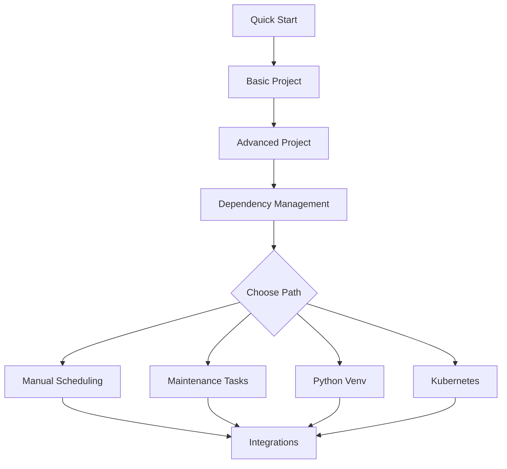

# Tutorials

Step-by-step guides to help you master dmp-af features and capabilities.

## Getting Started Tutorials

Perfect for newcomers to dmp-af:

### [Basic Project](basic-project.md)

Learn the fundamentals with a single-domain project:

- Setting up a simple dbt project with dmp-af
- Understanding DAG structure and naming
- Running small tests
- Single target configuration

**Time**: 15 minutes | **Level**: Beginner

### [Quick Start](../getting-started/quick-start.md)

Get up and running with the Jaffle Shop example:

- Docker Compose setup
- First DAG execution
- Verifying results

**Time**: 10 minutes | **Level**: Beginner

## Intermediate Tutorials

Expand your knowledge with multi-domain setups:

### [Advanced Project](advanced-project.md)

Build a complex multi-domain project:

- Multiple domains (service and data mart layers)
- Medium and large test separation
- Different dbt targets per environment
- Cross-domain dependencies

**Time**: 30 minutes | **Level**: Intermediate

### [Dependency Management](dependencies.md)

Master cross-domain and cross-schedule dependencies:

- Configuring upstream dependencies
- Skip policies for dependencies
- Wait policies (last vs. all runs)
- Cross-domain data flow

**Time**: 20 minutes | **Level**: Intermediate

## Advanced Tutorials

Explore powerful features for production use:

### [Manual Scheduling](manual-scheduling.md)

Control when models run:

- `@manual` schedule tag
- On-demand execution
- Triggering from other DAGs

**Time**: 15 minutes | **Level**: Advanced

### [Maintenance Tasks](maintenance.md)

Keep your data warehouse clean:

- TTL-based data deletion
- Source freshness checks
- Automated maintenance workflows

**Time**: 25 minutes | **Level**: Advanced

## Specialized Tutorials

Integration with other systems and technologies:

### [Python Virtual Environments](python-venv.md)

Run dbt models with custom Python environments:

- Creating isolated Python environments
- Installing custom packages
- Running Python models

**Time**: 20 minutes | **Level**: Advanced

### [Kubernetes Tasks](kubernetes.md)

Scale dbt execution on Kubernetes:

- Kubernetes Pod configuration
- Resource limits and requests
- Running models in K8s clusters

**Time**: 30 minutes | **Level**: Advanced

### [Integrations](integrations.md)

Connect dmp-af with other tools:

- Monte Carlo Data catalog integration
- Tableau refresh tasks
- Custom integrations

**Time**: 25 minutes | **Level**: Advanced

## Tutorial Format

Each tutorial includes:

- **Prerequisites**: What you need before starting
- **Learning Objectives**: What you'll accomplish
- **Step-by-Step Instructions**: Clear, actionable steps
- **Code Examples**: Ready-to-use configurations
- **Troubleshooting**: Common issues and solutions

## Example Project

All tutorials use variations of the [Jaffle Shop](https://github.com/dbt-labs/jaffle_shop) example project, modified to demonstrate dmp-af features.

The full example code is available in the `examples/` directory of the repository.

## Prerequisites

Before starting these tutorials, ensure you have:

1. **Completed [Getting Started](../getting-started/index.md)**
2. **Working Airflow installation** (local or Docker)
3. **dmp-af installed**: `pip install dmp-af`
4. **Basic dbt knowledge** (models, tests, dependencies)

## Learning Path

We recommend following tutorials in this order:

## Need Help?

- Check [Configuration Reference](../configuration/index.md) for detailed options
- Explore [Features](../features/index.md) for capability overviews
- Visit [GitHub Issues](https://github.com/dmp-labs/dmp-af/issues) for support
