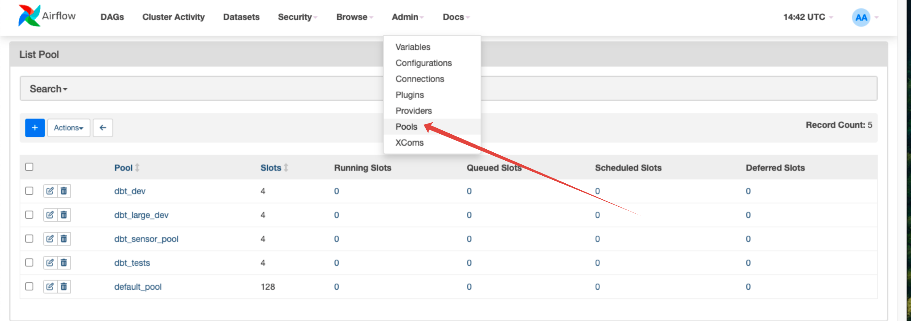

# dmp-af Tutorial

## Quick Start

### Prerequisites

1. Running instance of Airflow. There are a few ways to get this. The easiest is to use the Docker Compose to get a
   local instance running. See [Managing Airflow Instances](#managing-airflow-instances-docker-compose) section below
   and [docs](using_docker_compose.md) for more information.
2. Install `dmp-af` if you are not using the Docker Compose method.
    - via pip: `pip install dmp-af[tests,examples]`
3. (Optional) Build dbt manifest manually. When using the `manage-airflow.sh` script, the manifest is built
   automatically. If needed, you can rebuild it manually using the provided [script](./dags/build_manifest.sh):
    ```bash
    cd examples/dags
    ./build_manifest.sh
    ```
4. Add `dbt_dev` and
   `dbt_sensor_pool` [pools](https://airflow.apache.org/docs/apache-airflow/stable/administration-and-deployment/pools.html)
   to Airflow. When using the `manage-airflow.sh` script with Docker Compose, these pools are created automatically.
   For manual setup:

    - By using Airflow UI 
    - By using Airflow CLI: `airflow pools set dbt_dev 4 "dev"`

   Start with some small numbers of open slots in pools.
   If you are using your local machine, a large number of tasks can overflow your machine's resources.

## Managing Airflow Instances (Docker Compose)

A convenience script is provided to easily start and stop Airflow instances for both version 2.x and 3.x.

The script automatically handles the following setup tasks:

1. **Creates `.env` file** with appropriate settings based on your operating system:
   - **Linux**: Sets `AIRFLOW_UID` to match your host user ID to avoid permission issues with mounted volumes
   - **Mac/Windows**: Uses the default `AIRFLOW_UID=50000`

2. **Builds dbt manifest** automatically when starting services (runs `build_manifest.sh`)

### Usage

```bash
cd examples
./manage-airflow.sh [ACTION] [VERSION] [DOCKER_ARGS...]
```

**Arguments:**

- `ACTION` - Operation to perform (required)
- `VERSION` - Airflow version: `2` or `3` (required)
- `DOCKER_ARGS` - Additional arguments to pass to docker compose (optional)

**Actions:**

- `up` - Start Airflow services
- `down` - Stop Airflow services
- `restart` - Restart Airflow services
- `build` - Build/rebuild Docker images
- `logs` - Show logs from services
- `status` - Show status of services
- `ps` - List running containers

**Versions:**

- `2` - Use Airflow 2.x (docker-compose.yaml)
- `3` - Use Airflow 3.x (docker-compose3.yaml)

### Examples

```bash
# Start Airflow 2.x
./manage-airflow.sh up 2

# Start Airflow 2.x with force recreate
./manage-airflow.sh up 2 --force-recreate

# Stop Airflow 3.x
./manage-airflow.sh down 3

# Stop Airflow 3.x and remove volumes
./manage-airflow.sh down 3 -v

# Check status of Airflow 2.x services
./manage-airflow.sh status 2

# View logs for Airflow 3.x (last 100 lines)
./manage-airflow.sh logs 3 --tail=100

# Rebuild images for Airflow 3.x without cache
./manage-airflow.sh build 3 --no-cache

# Restart specific service
./manage-airflow.sh restart 2 airflow-webserver
```

### Important Notes

- **Automatic Setup**: The script automatically handles:
  - `.env` file creation with OS-specific settings
  - dbt manifest generation
  - Airflow pool creation (via docker-compose services)
- **Additional Arguments**: You can pass any docker compose arguments after the version number. Common examples:
  - `--force-recreate` - Force recreation of containers
  - `--no-cache` - Build images without using cache
  - `-v` - Remove volumes when stopping
  - `--tail=N` - Show last N lines of logs
- **Port Conflicts**: Both Airflow 2.x and 3.x use port 8080. Make sure to stop one version before starting another to
  avoid conflicts.
- **Web Access**:
    - Airflow 2.x: Webserver at http://localhost:8080
    - Airflow 3.x: API Server at http://localhost:8080
- **Default Credentials**: Username: `airflow`, Password: `airflow`
- **Startup Time**: Services may take a few minutes to be fully ready after starting.
